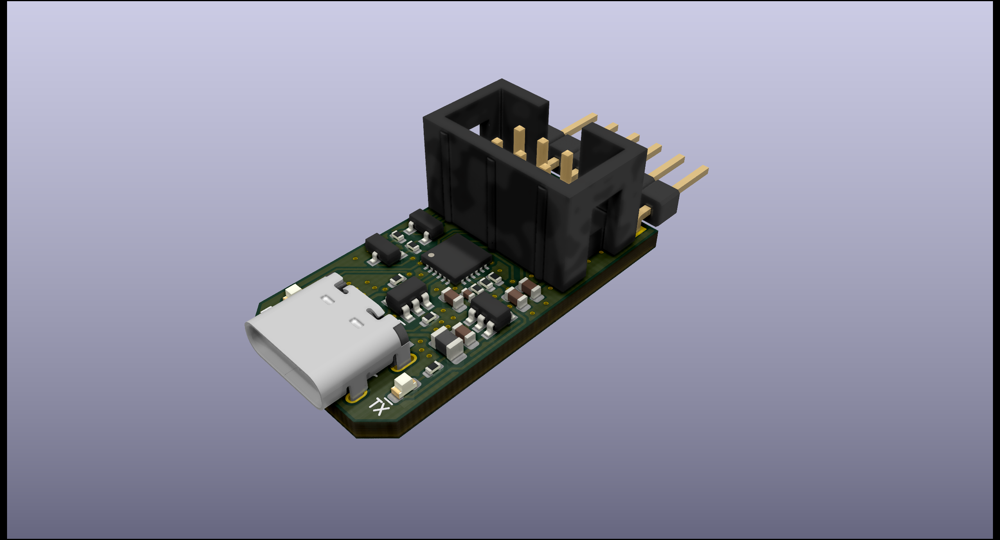

# CP2104-M8

CP2104 Breakout Board with USB-C and Reset Circuit for ESP-Chips. Features standard FTDI-Header as well as Tag Connect (TC2030) header (Check schematic for pinout). Components were selected so that only Basic Parts from JLCPCB's SMT Assembly Service are used (With the exception of the voltage regulator!).

